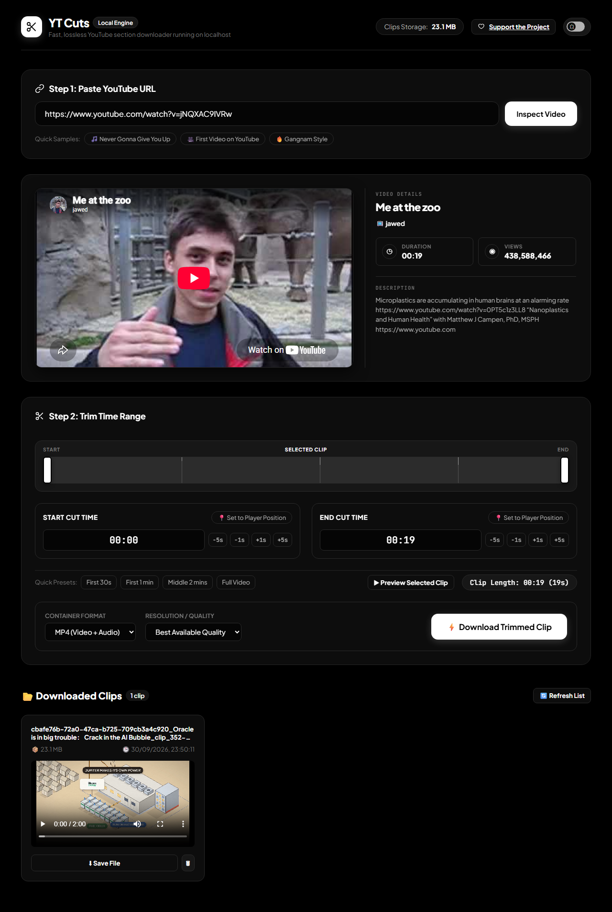
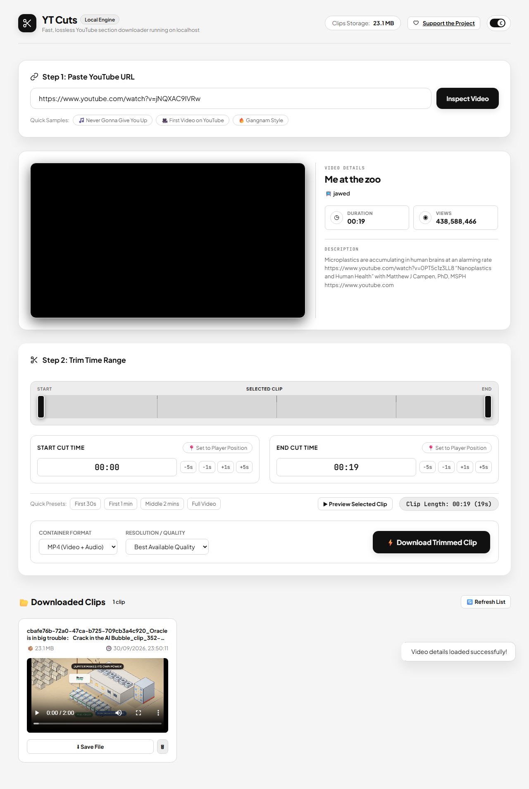

# YT Cuts

YT Cuts is a local YouTube clip editor and downloader. It lets you inspect a YouTube video, choose a time range, preview the selected section, and save the clip locally as MP4, WebM, MKV, or MP3.

<p align="center">
  
  
</p>

The application runs on your own computer and is intended for one local user. The FastAPI backend uses `yt-dlp` to retrieve video information and download the selected section, while the browser provides the trimming controls and live progress display. The app is not a public hosted service and must remain bound to localhost unless it is separately hardened.

## Features

- Inspect YouTube video metadata before downloading
- Embedded YouTube preview with a fallback link when embedding is unavailable
- Interactive start and end time controls
- Timeline scrubber and playback position controls
- Quick presets for common clip lengths
- MP4, WebM, MKV, and MP3 output options
- Selectable video quality, including best available, 1080p, 720p, and 480p when available
- Bounded concurrent media fragment downloads for improved speed
- Live download progress, speed, ETA, and subprocess logs
- Stop an active download and remove partial files
- Local downloaded-clip gallery with file size and delete controls
- Optional voluntary project support through Buy Me a Coffee
- Responsive layout for desktop, tablet, and small mobile screens

## How It Works

1. Paste a YouTube URL into the input field.
2. Select **Inspect Video** to load metadata and the preview.
3. Set the start and end times with the timeline, time fields, presets, or player position buttons.
4. Choose the output format and quality.
5. Select **Download Trimmed Clip**.
6. Watch the live progress or stop the download if needed.
7. Download completed clips from the local gallery.

## Requirements

- Windows, macOS, or Linux
- Python 3.10 or newer recommended
- Internet access for YouTube metadata and downloads
- A modern web browser

The Python dependency `static-ffmpeg` supplies ffmpeg binaries automatically, so a separate ffmpeg installation is normally not required.

## Installation

Clone the repository and enter the project directory:

```bash
git clone https://github.com/DreamLogicApps/YTcuts.git
cd YTcuts
```

Create and activate a virtual environment.

Windows PowerShell:

```powershell
python -m venv .venv
.\.venv\Scripts\Activate.ps1
```

macOS or Linux:

```bash
python3 -m venv .venv
source .venv/bin/activate
```

Install dependencies:

```bash
python -m pip install --upgrade pip
python -m pip install -r requirements.txt
```

## Running the App

With the virtual environment active, run:

```bash
python run.py
```

The server starts at:

```text
http://127.0.0.1:8000
```

Open that address in your browser. FastAPI API documentation is available at:

```text
http://127.0.0.1:8000/docs
```

The launcher enables automatic reload during development. Stop the server with `Ctrl+C`.

## Deployment

The current application is designed for local use. See [Deployment](docs/DEPLOYMENT.md) for the local runtime model and its security boundary.

## Project Structure

```text
YT Cuts/
├── backend/
│   ├── config.py              Application paths and ffmpeg setup
│   ├── downloader.py          yt-dlp downloads, progress, and cancellation
│   ├── metadata.py            YouTube metadata extraction
│   ├── main.py                FastAPI application setup
│   └── routes/
│       ├── download.py        Download and progress endpoints
│       ├── files.py           Local clip listing and deletion
│       ├── info.py            Video metadata endpoint
│       └── support.py         Optional hosted support link
├── downloads/                 Locally generated clips
├── static/
│   ├── index.html             Web interface
│   ├── css/style.css          Theme and responsive layout
│   └── js/                    Frontend API, player, timeline, and app logic
├── requirements.txt           Python dependencies
├── LICENSE                    MIT open-source license
├── run.py                     Development server entry point
└── tests/                     Security boundary regression tests
```

## API Endpoints

| Method   | Endpoint                           | Purpose                                      |
| -------- | ---------------------------------- | -------------------------------------------- |
| `GET`    | `/api/info?url=...`                | Retrieve metadata for a YouTube URL          |
| `POST`   | `/api/download`                    | Start a trimmed clip download                |
| `GET`    | `/api/download/progress/{task_id}` | Stream live progress with Server-Sent Events |
| `GET`    | `/api/download/status/{task_id}`   | Retrieve current task status                 |
| `POST`   | `/api/download/{task_id}/cancel`   | Stop an active download                      |
| `GET`    | `/api/files`                       | List completed local clips                   |
| `DELETE` | `/api/files/{filename}`            | Delete a local clip                          |
| `GET`    | `/api/support`                     | Return the optional support link             |

Example download request:

```json
{
  "url": "https://www.youtube.com/watch?v=dQw4w9WgXcQ",
  "start_time": "00:00:10",
  "end_time": "00:00:40",
  "quality": "720",
  "output_format": "mp4"
}
```

## Security Model

The current release has no accounts, authentication, authorization, database, telemetry, payment processing inside the app, or remote job service. The local API and downloaded files are intentionally available to the local browser. Do not bind the server to a LAN or public interface. Request validation restricts media sources to YouTube, and local storage and active jobs are bounded, but this is not a multi-user security model.

YT Cuts is free to use and open source under the [MIT License](LICENSE). The **Support the Project** link is optional, opens the Buy Me a Coffee page in live mode or a local non-payment test page in demo mode, and does not unlock or gate any core functionality. Live mode is enabled by default; set `BUYMEACOFFEE_MODE=demo` when testing locally.

See the [optional support setup](docs/SUPPORT-CONTRIBUTIONS.md) for Buy Me a Coffee configuration details. No payment keys or payment details belong in this repository.

See the [security audit](SECURITY-AUDIT.md) for completed hardening and remaining release gates.

## Output Files

Completed files are saved in the `downloads/` directory. The directory is created automatically when the backend starts. Downloaded media and the local virtual environment are intentionally ignored by Git.

## Troubleshooting

### The server does not start

Make sure the virtual environment exists and dependencies are installed:

```bash
python -m pip install -r requirements.txt
python run.py
```

### A preview does not appear

Some YouTube videos disable third-party embedding, require authentication, are age-restricted, or are unavailable in the current region. The app shows a thumbnail and a direct YouTube link when the embedded player reports an error. The download may still work if yt-dlp can access the video.

### Downloads are slow

The app downloads concurrent media fragments and forces precise keyframe re-encoding at the cut boundaries to guarantee perfect audio/video synchronization. Selecting 720p or 480p instead of the best available quality can reduce download and merge time substantially.

### A download fails

Check the live console output in the progress card. YouTube changes can occasionally require a newer yt-dlp version:

```bash
python -m pip install --upgrade yt-dlp
```

## Legal and Responsible Use

Only download and edit videos you have permission to use. Respect YouTube's Terms of Service, copyright law, creator rights, and any access restrictions that apply to the content.

Read the current [Terms of Use](docs/TERMS.md), [Privacy Policy](docs/PRIVACY.md), [Disclaimer](docs/DISCLAIMER.md), [Refund and Cancellation Policy](docs/REFUND-CANCELLATION.md), and [support contribution notice](docs/SUPPORT-CONTRIBUTIONS.md). These documents describe the free open-source model and optional third-party checkout; obtain qualified legal and tax review before accepting contributions commercially.

See [CONTRIBUTING.md](CONTRIBUTING.md) for development setup and pull request checks.
